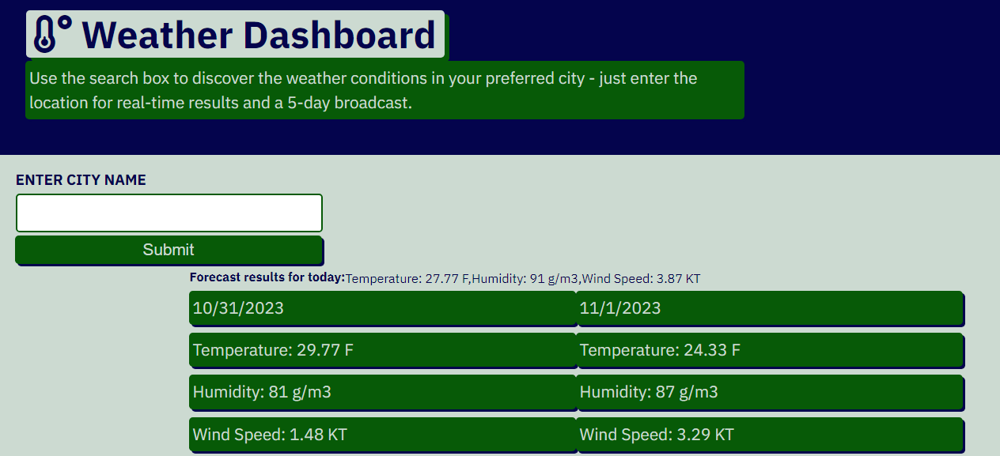

# Weather-App
## Description

The purpose of this challenge was to deploy a web application for the weather with interactive components. The project demonstrated dynamic HTML and CSS code, using JavaScript. 

Users should see a search box with an option to browse by location (city). The results should contain data from the OpenWeatherAPI displaying the temperature, humidity and wind speed for the present day as well as the next five. The search history should be captured so that the details can be viewed again. 

The acceptance criteria were as follows: 
GIVEN a weather dashboard with form inputs
WHEN I search for a city
THEN I am presented with current and future conditions for that city and that city is added to the search history
WHEN I view current weather conditions for that city
THEN I am presented with the city name, the date, an icon representation of weather conditions, the temperature, the humidity, and the wind speed
WHEN I view future weather conditions for that city
THEN I am presented with a 5-day forecast that displays the date, an icon representation of weather conditions, the temperature, the wind speed, and the humidity
WHEN I click on a city in the search history
THEN I am again presented with current and future conditions for that city.

Most acceptance criteria were met and the site has many of the display functionalities discussed above.

I learned how to use API to retrieve service data and display it dynamically. This required an understanding of the supporting documentation to perform effectively. For instance in reading the OpenWeatherAPI documentation, I found that default units are set to display the temperature in Kelvin. Including a query in the APIUrl allowed us to specify a preference for imperial units. Likewise, I realized that the data array contains data for the first 5 days in 3-hour increments which changes the way we loop through the array to show accurate time for each subsequent day. Furthermore, I realized how important it is to organize code on the js file so that it is easy to read - specifically I reorganized infrmation so that selected values are at the top, modifications grouped afterward, and appending methods last.  Previous eureka moments were just as valuable here - reformatting code, implementing clear naming convention, and notating often.  I am still working to make this a part of the build process. 
## Usage

The html, css, and js files can be used to understand the dynamic code that supports the application. A link to the mockup is listed below, for your convenience. 

https://watsona22.github.io/Weather-App/

## Credits

The project was completed with help from the course materials and assistance from Bootcamp tutor, Erik Hirsch.

## License

MIT License

Copyright (c) [2023] [Amber Watson]

Permission is hereby granted, free of charge, to any person obtaining a copy
of this software and associated documentation files (the "Software"), to deal
in the Software without restriction, including without limitation the rights
to use, copy, modify, merge, publish, distribute, sublicense, and/or sell
copies of the Software, and to permit persons to whom the Software is
furnished to do so, subject to the following conditions:

The above copyright notice and this permission notice shall be included in all
copies or substantial portions of the Software.

THE SOFTWARE IS PROVIDED "AS IS", WITHOUT WARRANTY OF ANY KIND, EXPRESS OR
IMPLIED, INCLUDING BUT NOT LIMITED TO THE WARRANTIES OF MERCHANTABILITY,
FITNESS FOR A PARTICULAR PURPOSE AND NONINFRINGEMENT. IN NO EVENT SHALL THE
AUTHORS OR COPYRIGHT HOLDERS BE LIABLE FOR ANY CLAIM, DAMAGES OR OTHER
LIABILITY, WHETHER IN AN ACTION OF CONTRACT, TORT OR OTHERWISE, ARISING FROM,
OUT OF OR IN CONNECTION WITH THE SOFTWARE OR THE USE OR OTHER DEALINGS IN THE
SOFTWARE.
